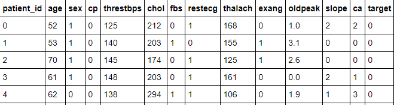
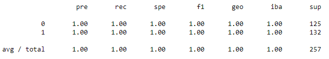
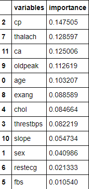

# heart_disease_analysis

## Description of the communication protocols

There are only two people in the team, Jingzhi and me. We are good friends, since we studied at the same university and worked together a lot, so it is easy for us to coordinate with each other. 

We would talk through Wechat, which is a Chinese  messaging and social media app.
We meet online twice a week:
 - 9pm to 11pm Tuesday 
 - 9pm to 11pm Friday 

### Assignment of tasks

Wenzhi Dong is responsible for presentation part and maching learning part.

Jingzhi is responsible for SQL.

We will do dashboard together.

## Random Forest

### Data Overview

"target" is the dependent variable. Other variables are feature variables.

### Data preprocessing
The data was spilted into two groups. Random Forest Model was used.

### Confusion Matrix

### Imbalanced Classification Report

### Variable Importance
cp, thalach and ca are the most important variables.

